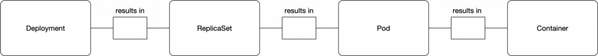
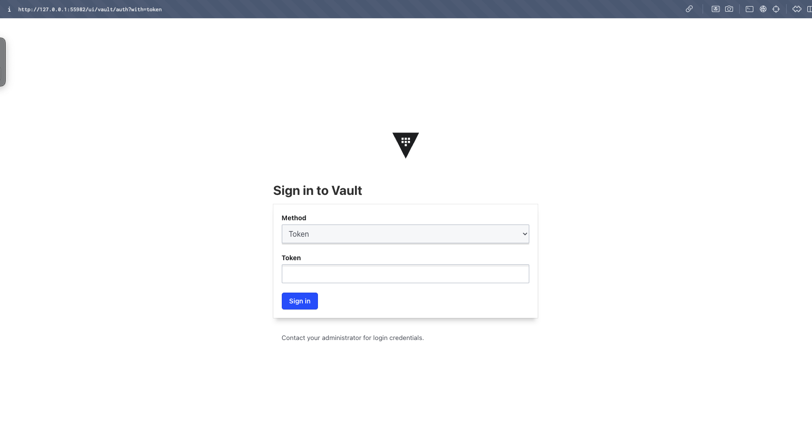
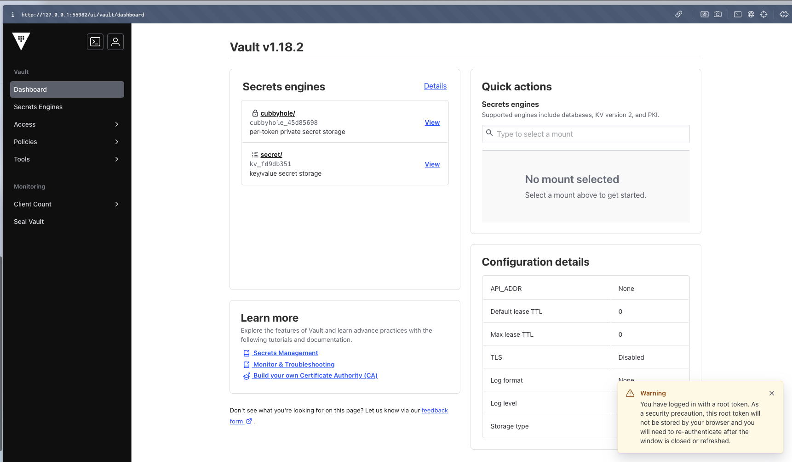

University: [ITMO University](https://itmo.ru/ru/)

Faculty: [FICT](https://fict.itmo.ru)

Course: [Introduction to distributed technologies](https://github.com/itmo-ict-faculty/introduction-to-distributed-technologies)

Year: 2024/2025

Group: K4112C

Author: Kudashev Iskander Eduardovich

Lab: Lab1

Date of create: 15.12.2024

Date of finished: 15.12.2024

# Лабораторная работа №1 "Установка Docker и Minikube, мой первый манифест."


## Minicube install

**minicube** - minikube is local Kubernetes, focusing on making it easy to learn and develop for Kubernetes.

```bash
brew install minikube

brew unlink minikube
brew link minikube
```


## Start cluster 

```bash
minikube start
```

## Install kubectl

```bash
minikube kubectl
```

## Написать манифест для развертывания "пода" HashiCorp Vault

под - представляет собой запрос на запуск одного или более контейнеров на одном узле.

под — это один и единственный объект в Kubernetes, который приводит к запуску контейнеров. Нет pod'а — нет контейнера



для того, чтобы манифест запустить нужно описать поведение запуска в vault-deployment.yaml

```yaml
apiVersion: v1
kind: Pod
metadata:
  name: vault
  labels:
    app: vault
spec:
  containers:
    - name: vault
      image: hashicorp/vault:latest
      ports:
        - containerPort: 8200
---
apiVersion: v1
kind: Service
metadata:
  name: vault-service
spec:
  selector:
    app: vault
  ports:
    - protocol: TCP
      port: 8200
      targetPort: 8200
  type: NodePort
```

после этого, запустим наш minicube и применим наш новый манифест

```bash
kubectl apply -f /Users/iskander-faggod/Desktop/2024_2025-introduction_to_distributed_technologies-k4112c-kudashev_i_e/lab1/vault-deployment.yaml
pod/vault created
```

result

``` bash
service/vault-service created
```

проверяем статус запущенного пода

```bash
>kubectl get pods

NAME    READY   STATUS    RESTARTS   AGE
vault   1/1     Running   0          2m47s
```

проверяем статусы запущенных сервисов

```bash
❯ kubectl get services

NAME            TYPE        CLUSTER-IP       EXTERNAL-IP   PORT(S)          AGE
kubernetes      ClusterIP   10.96.0.1        <none>        443/TCP          13m
vault-service   NodePort    10.108.220.218   <none>        8200:32448/TCP   4m30s
```

получем url для доступа к vault 

```bash
❯ minikube service vault-service --url

http://127.0.0.1:55982
```

проверяем что сервис правда работает на корректном порту



## Ответы на вопросы

### Что произошло?

_ранее мы создали манифесты для развертывания **HashiCorp Vault** в вашем кластере Kubernetes с использованием Minikube. Эти манифесты определяют Pod с контейнером Vault и Service для доступа к нему на порту 8200. После применения манифестов с помощью команды kubectl apply -f vault-deployment.yaml Kubernetes создал указанные ресурсы, и Vault был запущен в вашем кластере._

### Как найти токен?

вводим команду

```bash
 >kubectl logs vault
```

видим следуюущую информацию

Root Token: token

входим в сервис

