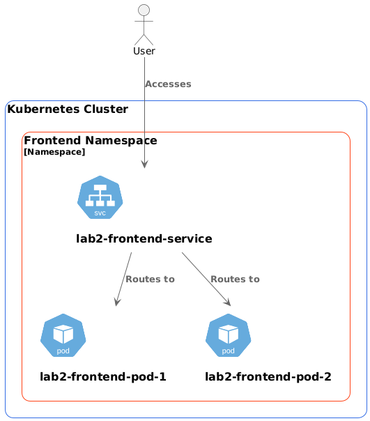

University: [ITMO University](https://itmo.ru/ru/)

Faculty: [FICT](https://fict.itmo.ru)

Course: [Introduction to distributed technologies](https://github.com/itmo-ict-faculty/introduction-to-distributed-technologies)

Year: 2024/2025

Group: K4112C

Author: Kudashev Iskander Eduardovich

Lab: Lab1

Date of create: 15.12.2024

Date of finished: 15.12.2024

# Лабораторная работа №2 "Развертывание веб сервиса в Minikube, доступ к веб интерфейсу сервиса. Мониторинг сервиса.""

создание манифеста deployment.yaml,пробросить в env необходимые переменнные

типы сервисов:

    ClusterIP: Это тип сервиса по умолчанию. Он предоставляет внутренний IP-адрес в кластере, доступный только изнутри кластера. Используется для организации взаимодействия между сервисами внутри кластера.

    NodePort: Этот тип сервиса открывает определенный порт на каждом узле (Node) кластера, позволяя внешним клиентам обращаться к сервису через <NodeIP>:<NodePort>. NodePort расширяет ClusterIP, предоставляя как внутренний, так и внешний доступ.

    LoadBalancer: Этот тип сервиса создает внешний балансировщик нагрузки (обычно поддерживается облачным провайдером), который распределяет трафик между подами. Он расширяет NodePort и ClusterIP, предоставляя единый внешний IP-адрес для доступа к сервису.

    ExternalName: Этот тип сервиса не предоставляет собственный IP-адрес или проксирование. Вместо этого он создает запись DNS, которая указывает на внешний DNS-имя. Используется для перенаправления трафика на внешние ресурсы, не являющиеся частью кластера.

    Headless Service: Особый тип сервиса, который не назначает кластерный IP-адрес. Он используется, когда требуется прямое взаимодействие с подами без балансировки нагрузки, например, для обнаружения подов с помощью DNS.
    
```yaml
apiVersion: apps/v1
kind: Deployment
metadata:
  name: lab2-frontend
spec:
  replicas: 2
  selector:
    matchLabels:
      app: lab2-frontend
  strategy:
    type: RollingUpdate
  template:
    metadata:
      labels:
        app: lab2-frontend
    spec:
      containers:
      - image: ifilyaninitmo/itdt-contained-frontend:master
        imagePullPolicy: Always
        name: lab2-frontend
        ports:
        - containerPort: 3000
        env:
        - name: REACT_APP_USERNAME
          value: "iskander"
        - name: REACT_APP_COMPANY_NAME
          value: "itmo"

```

описание:

- kind: Deployment: Определяет тип создаваемого объекта — в данном случае это Deployment, который управляет развертыванием и масштабированием набора Pod'ов.

- spec: Спецификация Deployment, включающая:
  - replicas: 2: Задает количество реплик Pod'ов, которые должны быть запущены. В данном случае — 2.
  
    - selector: Определяет, к каким Pod'ам будет применяться данный Deployment, используя метки:

    - env: Переменные окружения, передаваемые в контейнер

написать манифест для сервиса

```yaml
apiVersion: v1
kind: Service
metadata:
  labels:
    app: lab2-frontend
  name: lab2-frontend-service
spec:
  type: NodePort
  ports:
    - name: http
      port: 31000
      targetPort: 3000
  selector:
    app: lab2-frontend
```

описание:

- kind: Service: Определяет тип создаваемого объекта — в данном случае это сервис, который обеспечивает сетевой доступ к набору Pod'ов.

- spec: Спецификация сервиса, включающая:
    type: NodePort: Тип сервиса, который открывает определенный порт на каждом узле кластера, позволяя внешним клиентам обращаться к сервису через <NodeIP>:<NodePort>.
    выполнить следующие команды в консоли

- selector: Селектор, определяющий, к каким Pod'ам будет направляться трафик:
    app: app-server: Сервис будет отправлять трафик на все Pod'ы, имеющие метку app: app-server.

```bash
❯ kubectl apply -f /Users/iskander-faggod/Desktop/2024_2025-introduction_to_distributed_technologies-k4112c-kudashev_i_e/lab2/deployment.yaml
kubectl apply -f /Users/iskander-faggod/Desktop/2024_2025-introduction_to_distributed_technologies-k4112c-kudashev_i_e/lab2/service.yaml

deployment.apps/lab2-frontend configured
service/lab2-frontend-service configured
❯ minikube kubectl -- port-forward service/lab2-frontend-service 3000:31000


Forwarding from 127.0.0.1:3000 -> 3000
Forwarding from [::1]:3000 -> 3000
```

Использование dashboard для демонстрации запущенных подов


Использование на порту 3000


Диаграмма


