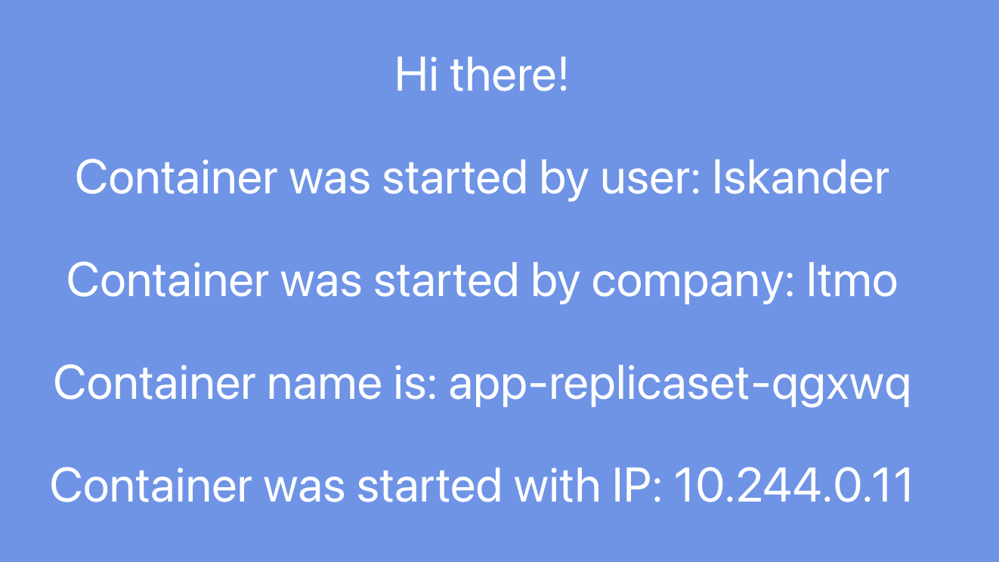
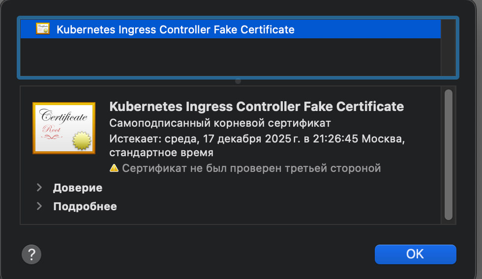

University: [ITMO University](https://itmo.ru/ru/)

Faculty: [FICT](https://fict.itmo.ru)

Course: [Introduction to distributed technologies](https://github.com/itmo-ict-faculty/introduction-to-distributed-technologies)

Year: 2024/2025

Group: K4112C

Author: Kudashev Iskander Eduardovich

Lab: Lab1

Date of create: 15.12.2024

Date of finished: 15.12.2024

# Лабораторная работа №3 "Сертификаты и "секреты" в Minikube, безопасное хранение данных."""

### Создание ConfigMap с переменными окружения

ConfigMap позволяет хранить конфигурационные данные в виде пар "ключ-значение" и использовать их в подах.

```yaml
apiVersion: v1
kind: ConfigMap
metadata:
  name: lab3-configmap
data:
  REACT_APP_USERNAME: "Iskander"
  REACT_APP_COMPANY_NAME: "Itmo"
```


### Создание ReplicaSet с 2 репликами контейнера и использованием ConfigMap:

ReplicaSet обеспечивает поддержание заданного количества подов, гарантируя их доступность.

```yaml
apiVersion: apps/v1
kind: ReplicaSet
metadata:
  name: lab3-replicaset
spec:
  replicas: 2
  selector:
    matchLabels:
      app: lab3-server
  template:
    metadata:
      labels:
        app: lab3-server
    spec:
      containers:
        - name: lab3-server
          image: ifilyaninitmo/itdt-contained-frontend:master
          ports:
            - containerPort: 3000
          env:
            - name: REACT_APP_USERNAME
              valueFrom:
                configMapKeyRef:
                  name: lab3-configmap
                  key: REACT_APP_USERNAME
            - name: REACT_APP_COMPANY_NAME
              valueFrom:
                configMapKeyRef:
                  name: lab3-configmap
                  key: REACT_APP_COMPANY_NAME
```

### Создание Service

объединяет поды с меткой app: lab3-server и обеспечивает доступ к ним через порт 80

```bash
apiVersion: v1
kind: Service
metadata:
  name: lab3-server-service
spec:
  selector:
    app: lab3-server
  ports:
    - port: 80
      targetPort: 3000
  type: NodePort

```

### Создание Ingress

предоставляет доступ к сервису lab3-server-service по доменному имени lab3.local с использованием HTTPS.

```bash
apiVersion: networking.k8s.io/v1
kind: Ingress
metadata:
  name: lab3-ingress
  annotations:
    nginx.ingress.kubernetes.io/ssl-redirect: "true"
spec:
  tls:
    - hosts:
        - lab3.local
      secretName: lab3-tls-secret
  rules:
    - host: lab3.local
      http:
        paths:
          - path: /
            pathType: Prefix
            backend:
              service:
                name: lab3-server-service
                port:
                  number: 80

```

включить Ingress в Minikube

```bash
minikube addons enable ingress
```

Ingress — это объект, который управляет внешним доступом к сервисам внутри кластера, обычно через HTTP и HTTPS. Он позволяет определить правила маршрутизации, такие как сопоставление URL-путей или доменных имен с конкретными сервисами, обеспечивая более гибкий и управляемый способ экспонирования приложений

для того чтобы объекты Ingress функционировали, в кластере должен быть развернут Ingress Controller. Это компонент, который интерпретирует ресурсы Ingress и настраивает соответствующий прокси-сервер или балансировщик нагрузки для обработки входящего трафика в соответствии с определенными правилами. Без установленного Ingress Controller объекты Ingress не будут работать

создать сертификат

```bash
openssl req -x509 -nodes -days 365 -newkey rsa:2048 -keyout tls.key -out tls.crt -subj "/CN=your.fqdn.com/O=YourOrg"
```

добавить секреты в kubernetes

```bash
❯ kubectl create secret tls frontend-tls --key tls.key --cert tls.crt

secret/frontend-tls created
```

```

применяем файлы командой

```bash
kubectl apply -f /Users/iskander-faggod/Desktop/2024_2025-introduction_to_distributed_technologies-k4112c-kudashev_i_e/lab3/configmap.yaml

kubectl apply -f /Users/iskander-faggod/Desktop/2024_2025-introduction_to_distributed_technologies-k4112c-kudashev_i_e/lab3/replicaset.yaml

kubectl apply -f /Users/iskander-faggod/Desktop/2024_2025-introduction_to_distributed_technologies-k4112c-kudashev_i_e/lab3/ingress.yaml
```


```bash
❯ minikube ip
```

по /etc/hosts ставим ip minikube / app.local

запускает и проверяем фронт 

проверяем сертификат

