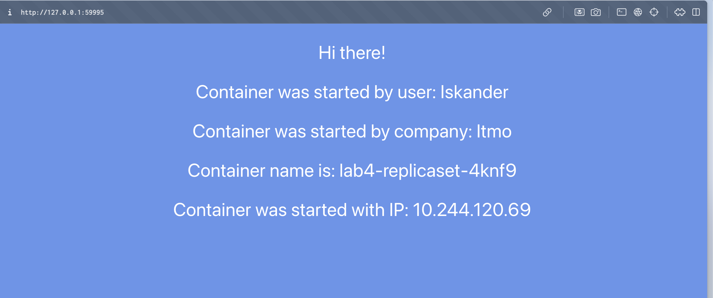
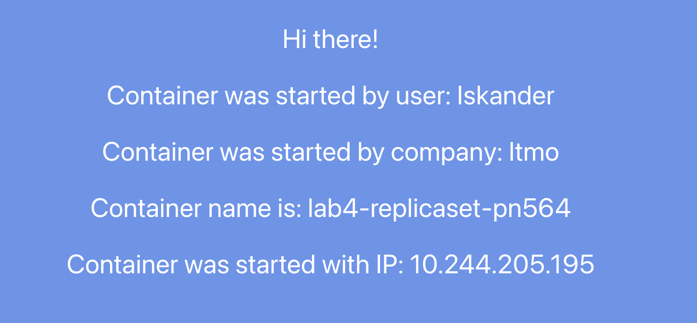
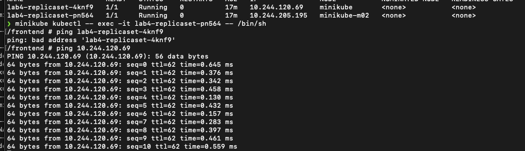

University: [ITMO University](https://itmo.ru/ru/)

Faculty: [FICT](https://fict.itmo.ru)

Course: [Introduction to distributed technologies](https://github.com/itmo-ict-faculty/introduction-to-distributed-technologies)

Year: 2024/2025

Group: K4112C

Author: Kudashev Iskander Eduardovich

Lab: Lab1

Date of create: 15.12.2024

Date of finished: 17.12.2024

# Лабораторная работа №4 "Сети связи в Minikube, CNI и CoreDNS

Копируем configmap и service из прыдыдущей лабораторной работы

**Calico** — это популярный плагин с открытым исходным кодом для обеспечения сетевой связи и безопасности в Kubernetes и других облачных платформах. Он предоставляет высокопроизводительную сетевую инфраструктуру, поддерживает сетевые политики и обеспечивает безопасность на уровне сети. 

Основные функции Calico:

* Сетевая политика (Network Policy): Calico расширяет возможности стандартных сетевых политик Kubernetes, предоставляя более гибкие и мощные инструменты для управления трафиком между подами. 

* Маршрутизация на уровне L3: Calico использует маршрутизацию на уровне третьего уровня модели OSI, что обеспечивает высокую производительность и масштабируемость сети. 

* Безопасность: Calico поддерживает шифрование трафика с помощью WireGuard, обеспечивая защиту данных при передаче. 

необходимо было запустить minikube с указанием в качестве CNI (Container Network Interface) calico.

```bash
minikube start --cni=calico
```

проверяем, работают ли порты calico

```bash
❯ watch minikube kubectl -- get pods -l k8s-app=calico-node -A


Every 2,0s: minikube ku...  MacBook-Pro-Iskander.local: Tue Dec 17 22:43:51 2024

NAMESPACE     NAME                READY   STATUS    RESTARTS   AGE
kube-system   calico-node-fnj7z   1/1     Running   0          8m27s
```

запускаем вторую ноду minikube

```bash
minikube node add
```

проверяем доступные ноды

```bash
❯  minikube kubectl -- get nodes
NAME           STATUS   ROLES           AGE   VERSION
minikube       Ready    control-plane   10m   v1.31.0
minikube-m02   Ready    <none>          2s    v1.31.0
```

было запущено две ноды и использова CNI calico.

нода (узел) — это физический или виртуальный сервер, на котором запускаются компоненты кластера и рабочие нагрузки. Каждая нода содержит необходимые сервисы для работы подов и управляется контрольной плоскостью Kubernetes.

Основные компоненты ноды:

* Kubelet: Агент, отвечающий за взаимодействие с контрольной плоскостью и управление подами на ноде.

* Kube-proxy: Сетевой прокси, обеспечивающий сетевое взаимодействие и балансировку нагрузки между сервисами.

* Среда выполнения контейнеров (например, Docker, containerd): Платформа для запуска и управления контейнерами.

## Node labels и IPPools

labels — это пары "ключ-значение", которые присваиваются объектам Kubernetes, включая узлы (ноды). Они используются для идентификации и организации ресурсов, а также для управления размещением рабочих нагрузок.

Применение меток узлов:

* Управление размещением подов: Метки позволяют задавать, на каких узлах должны запускаться определенные поды, используя nodeSelector или nodeAffinity в спецификации пода.

* Организация и фильтрация: Метки помогают группировать узлы по определенным характеристикам, таким как тип оборудования, местоположение или предназначение, что облегчает управление и мониторинг.

Примеры стандартных меток узлов:

* kubernetes.io/hostname: имя хоста узла.

* kubernetes.io/os: операционная система узла.

* topology.kubernetes.io/region: регион, в котором находится узел.

* topology.kubernetes.io/zone: зона, в которой находится узел.

используем метки по географическому значению (ru-north, ru-south)

```bash
minikube kubectl -- label nodes minikube zone=ru-north
minikube kubectl -- label nodes minikube-m02 zone=ru-south
```

смотрим метки

```bash
minikube kubectl -- get nodes --show-labels
```

    NAME           STATUS   ROLES           AGE     VERSION   LABELS
    minikube       Ready    control-plane   18m     v1.31.0   beta.kubernetes.io/arch=arm64,beta.kubernetes.io/os=linux,kubernetes.io/arch=arm64,kubernetes.io/hostname=minikube,kubernetes.io/os=linux,minikube.k8s.io/commit=210b148df93a80eb872ecbeb7e35281b3c582c61,minikube.k8s.io/name=minikube,minikube.k8s.io/primary=true,minikube.k8s.io/updated_at=2024_12_17T22_35_20_0700,minikube.k8s.io/version=v1.34.0,node-role.kubernetes.io/control-plane=,node.kubernetes.io/exclude-from-external-load-balancers=,zone=ru-north
    minikube-m02   Ready    <none>          8m45s   v1.31.0   beta.kubernetes.io/arch=arm64,beta.kubernetes.io/os=linux,kubernetes.io/arch=arm64,kubernetes.io/hostname=minikube-m02,kubernetes.io/os=linux,minikube.k8s.io/commit=210b148df93a80eb872ecbeb7e35281b3c582c61,minikube.k8s.io/name=minikube,minikube.k8s.io/primary=false,minikube.k8s.io/updated_at=2024_12_17T22_45_27_0700,minikube.k8s.io/version=v1.34.0,zone=ru-south

напишем yaml для IPPOL манифестов

ключевыми отличями этих файлов являются поля cidr и nodeSelector. В cidr указываются те ip-адреса которые будут назначены подами из той или иной ноды, из северной и южной соответсвено. А в nodeSelector указывается ранее установленные labels

ru-north-pool

```yaml
apiVersion: crd.projectcalico.org/v1
kind: IPPool
metadata:
  name: north-zone-ippool
spec:
  cidr: 192.168.1.0/24
  ipipMode: Always
  natOutgoing: true
  nodeSelector: zone == "ru-north"
```

ru-south-pool

```yaml
apiVersion: crd.projectcalico.org/v1
kind: IPPool
metadata:
  name: south-zone-ippool
spec: 
  cidr: 192.168.2.0/24
  ipipMode: Always
  natOutgoing: true
  nodeSelector: zone == 'ru-south'
```

* cidr: Определяет диапазон IP-адресов, доступных для назначения подам.

* ipipMode: Указывает режим использования IP-in-IP туннелирования для межнодовой связи. Значение Always означает, что туннелирование будет использоваться всегда.

* natOutgoing: При значении true исходящий трафик от подов, использующих этот пул, будет подвергаться NAT (маскарадингу), что позволяет подам инициировать соединения с внешними ресурсами.

* nodeSelector: Определяет, на каких узлах будет использоваться данный пул IP-адресов, основываясь на метках узлов. В данном случае, пул north-zone-ippool применяется к узлам с меткой zone=ru-north, а south-zone-ippool — к узлам с меткой zone=ru-south.

эти конфигурации позволяют распределять IP-адреса из разных диапазонов в зависимости от зоны, к которой принадлежит узел

```bash
❯ kubectl apply -f /Users/iskander-faggod/Desktop/2024_2025-introduction_to_distributed_technologies-k4112c-kudashev_i_e/lab4/ru-north-pool.yaml

ippool.crd.projectcalico.org/north-zone-ippool created

❯ kubectl apply -f /Users/iskander-faggod/Desktop/2024_2025-introduction_to_distributed_technologies-k4112c-kudashev_i_e/lab4/ru-south-pool.yaml


ippool.crd.projectcalico.org/south-zone-ippool created
```

проверяем IPools

```bash
❯ minikube kubectl -- get ippools.crd.projectcalico.org
NAME                  AGE
default-ipv4-ippool   33m
north-zone-ippool     33s
south-zone-ippool     26s
```

исполняем run script

```bash
❯ chmod +x /Users/iskander-faggod/Desktop/2024_2025-introduction_to_distributed_technologies-k4112c-kudashev_i_e/lab4/run.sh

❯ /Users/iskander-faggod/Desktop/2024_2025-introduction_to_distributed_technologies-k4112c-kudashev_i_e/lab4/run.sh
```




мое приложение развернуто с использованием ReplicaSet с двумя репликами, что означает наличие двух идентичных подов, каждый из которых содержит экземпляр вашего приложения.

при каждом обновлении страницы браузер может подключаться к разным подам через сервис Kubernetes, который распределяет трафик между этими подами.

поскольку каждый под имеет уникальные имя и IP-адрес, переменные Container name и Container IP будут меняться в зависимости от того, к какому поду произошло подключение.


проверить пингуется ли один под другим, для этго необходимо "войти" в под и пропинговать другой.

```bash
❯ minikube kubectl -- get pods -o wide
NAME                    READY   STATUS    RESTARTS   AGE   IP               NODE           NOMINATED NODE   READINESS GATES
lab4-replicaset-4knf9   1/1     Running   0          17m   10.244.120.69    minikube       <none>           <none>
lab4-replicaset-pn564   1/1     Running   0          17m   10.244.205.195   minikube-m02   <none>           <none>
```

